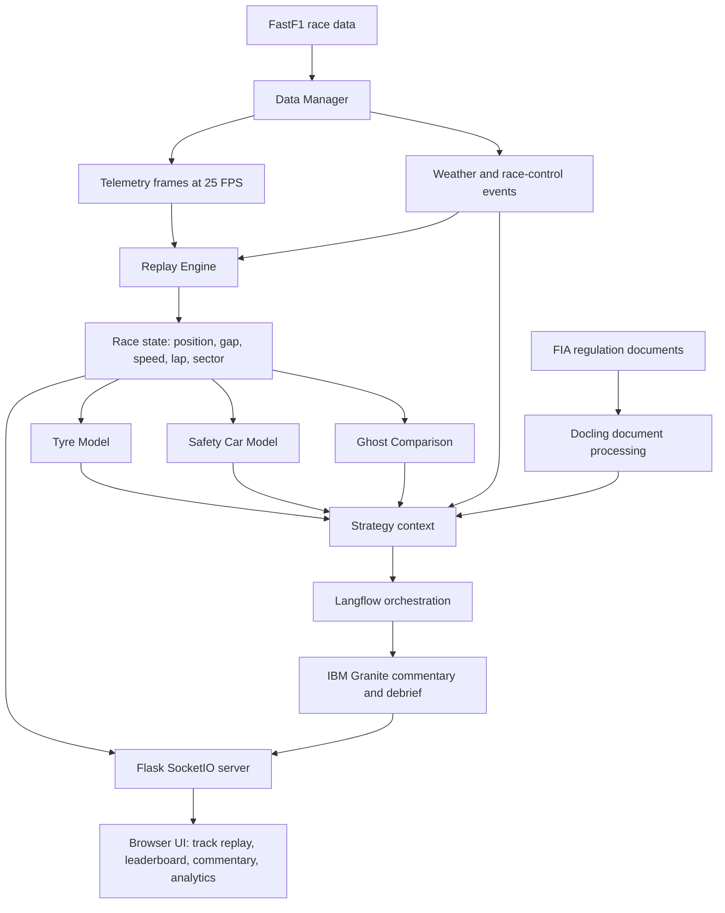

# 🏎️ Chronos F1 — AI-Powered Race Intelligence Platform


[](https://github.com/ibm-granite-community)
[](https://www.docling.ai)
[](https://www.langflow.org)
[](https://www.python.org)
[](https://flask.palletsprojects.com)

Chronos F1 is an AI-powered race replay and intelligence platform for Formula 1. It combines telemetry, weather, tyre state, safety car phases, regulations, and race-control context into a live replay system with explainable AI commentary and strategy analysis.

> [!IMPORTANT]
> Chronos F1 is built for the part of racing that is hardest to understand live: when thousands of data signals change strategy faster than a viewer can process them.

## Problem

Formula 1 is not just speed. Every lap is shaped by tyre degradation, pit timing, weather, traffic, DRS, safety cars, and regulations. Teams can read this complexity through engineering tools, but fans and analysts often see only the visible result: a pass, a pit stop, or a sudden strategy swing.

> [!NOTE]
> The core problem is not a lack of racing data. It is that the most important signals are scattered, fast-moving, and hard to explain while the race is still unfolding.

<details>
<summary>Why race intelligence is difficult</summary>

Formula 1 generates about 1.5 million data points per second during a race. Teams, drivers, and fans struggle to:

- Understand complex race strategies in real time.
- Predict optimal pit stop windows from tyre degradation.
- Analyze safety car impact on race outcomes.
- Make sense of regulations during critical moments.
- Experience races with intelligent, context-aware commentary.

These moments are especially difficult because race context changes across several systems at once. A safety car can alter pit strategy, tyre temperature can change stint viability, and a regulation detail can reshape how a race-control message should be understood.

</details>

| Problem | Why it is difficult | Chronos F1 response |
| --- | --- | --- |
| Race context is fragmented | Telemetry, weather, timing, and regulations live in separate streams | Combines race data into one synchronized replay |
| Strategy is hard to explain live | Pit windows and tyre choices depend on fast-changing conditions | Models tyre health, safety car impact, and race events |
| AI output needs trust | Commentary is only useful when it explains the reason behind an insight | Uses explainable, context-aware AI commentary |

## Our Solution

Chronos F1 transforms the F1 viewing experience by applying AI to race analysis, strategy optimization, and fan engagement. It processes high-volume telemetry in real time, generates insightful commentary, and produces explainable strategic recommendations that show why a racing moment matters.

> [!TIP]
> Chronos F1 keeps the race logic deterministic and uses AI for interpretation. That makes the platform easier to trust: the replay state comes from structured telemetry, while IBM Granite explains the strategy and context around it.

## AI and Technical Approach

Chronos F1 combines deterministic race simulation with AI-generated interpretation. The replay engine keeps race state accurate, while AI layers explain what is happening, why it matters, and how it may affect strategy.



<details>
<summary>Technical components</summary>

| Layer | Files | Responsibility |
| --- | --- | --- |
| Race data | `manager/dataManager.py` | Loads FastF1 sessions, telemetry, weather, timing, and messages |
| Replay | `replay/replayEngine.py`, `replay/ghostEngine.py` | Streams synchronized race frames and comparison state |
| Models | `models/tyreModel.py`, `models/safetyCarModel.py` | Predicts tyre health and simulates safety car behavior |
| AI | `ai/graniteClient.py`, `ai/aiCommentary.py`, `ai/raceDebrief.py` | Generates commentary, insight, and post-race analysis |
| Documents | `documents/documentProcessor.py` | Processes regulation text for contextual AI responses |
| Workflows | `workflows/langflowIntegration.py` | Coordinates multi-stage strategy and analysis flows |
| Web app | `app.py`, `templates/index.html`, `static/` | Serves the live UI through Flask and SocketIO |

</details>

<details>
<summary>AI innovation details</summary>

### Explainable AI Commentary

Traditional race commentary can miss the strategic reason behind a moment. Chronos F1 analyzes telemetry and event context, then uses IBM Granite to explain race situations in plain language.

- Analyzes 60+ telemetry parameters per frame.
- Detects race events such as overtakes, pit stops, DRS activation, and high-speed moments.
- Generates context-aware commentary every 90 seconds.
- Explains strategic implications instead of only describing visible action.
- Adds regulatory context from FIA documents where relevant.

Example:

```text
Verstappen pits from the lead on lap 18, earlier than expected.
With track temperatures rising, his soft tyres were degrading faster
than predicted. This undercut attempt could gain time if Hamilton
stays out another lap.
```

### Predictive Tyre Strategy

Tyre degradation is one of the most important strategy variables in racing. Chronos F1 models compound wear so pit windows and tyre risk are easier to understand.

- Predicts remaining laps for each compound.
- Calculates health scores from 0 to 100%.
- Recommends strategic pit windows.
- Adapts interpretation to weather and stint context.
- Provides confidence-aware explanations.

```python
health = 100 * exp(-degradation_rate * tyre_age)

rates = {
    "SOFT": 0.08,
    "MEDIUM": 0.05,
    "HARD": 0.03,
    "INTERMEDIATE": 0.06,
    "WET": 0.04,
}
```

### Multi-Modal AI Integration

Chronos F1 combines three AI-oriented systems:

| System | Role |
| --- | --- |
| IBM Granite | Natural language commentary and debrief generation |
| Docling | Regulation and document understanding |
| Langflow | Workflow orchestration for multi-step race analysis |

</details>

## Why It Matters in Racing

Racing decisions are time-sensitive. A tyre drop-off, safety car, or undercut opportunity can change a Grand Prix within seconds. Chronos F1 makes those moments easier to see, explain, and review.

For fans, it adds context that usually lives inside team radio and strategy rooms. For analysts, it creates a replayable view of decisions and consequences. For builders, it demonstrates how AI can sit on top of live sports data without replacing the underlying race logic.

## Features

| Feature | What it does |
| --- | --- |
| Fan and engineer modes | Switches between broadcast-style narration and technical analysis |
| AI race debrief | Summarizes strategy, key events, tyre performance, and safety car impact |
| Ghost comparison | Compares a selected driver against a reference lap with live delta timing |
| IBM Granite commentary | Generates race-aware commentary from telemetry and event context |
| Docling document intelligence | Adds regulation and document context to AI responses |
| Langflow orchestration | Coordinates multi-stage analysis pipelines |
| Advanced analytics | Tracks telemetry, tyre health, safety car phases, and weather |
| Interactive visualization | Provides replay controls, driver selection, overlays, and race-control feed |

<details>
<summary>Core feature details</summary>

### Fan Mode and Engineer Mode

- Uses one telemetry pipeline for both commentary styles.
- Fan Mode produces simple broadcast-style narration.
- Engineer Mode produces technical, data-driven analysis.
- Commentary mode can be switched in real time.

Examples:

```text
Fan Mode: Hamilton closes into DRS range.
Engineer Mode: Hamilton reduced the gap by 0.28 seconds through improved exit speed.
```

### AI Race Debrief

- Generates automatically at replay completion.
- Identifies best strategy choices.
- Builds a critical race event timeline.
- Highlights the most aggressive driver.
- Compares tyre efficiency.
- Assesses safety car impact.
- Compares predicted and actual outcomes.
- Produces AI strategic recommendations and a professional race summary.
- Supports full-screen modal or side-panel display.

### Ghost Comparison System

- Compares against a fastest-lap reference.
- Shows live delta timing.
- Tracks three sectors.
- Smooths comparison with interpolation from 0.25x to 8x playback.
- Visualizes the ghost driver on track.
- Shows real-time speed differential.

Delta timing states:

| State | Meaning |
| --- | --- |
| Green | Gaining time |
| Red | Losing time |
| Gold | Fastest sector or within 0.05 seconds |

### AI and Workflow Features

- IBM Granite generates real-time race commentary.
- Event detection covers overtakes, pit stops, DRS activation, crashes, and high-speed moments.
- Docling processes FIA regulations and race documents.
- Regulatory context can be injected during critical moments.
- Langflow coordinates modular analysis workflows.
- Automated insight generation runs every 90 seconds.

</details>

<details>
<summary>Advanced analytics and visualization</summary>

### Real-Time Telemetry Processing

- 25 FPS live replay with sub-second accuracy.
- Position tracking with leader and interval gap calculations.
- Speed, throttle, and brake analysis for all drivers.
- DRS zone detection and activation tracking.
- Lap-by-lap progression with distance metrics.

### Predictive Tyre Model

- Bayesian degradation prediction for all tyre compounds.
- Remaining lap estimation based on wear patterns.
- Compound-specific curves for Soft, Medium, Hard, Intermediate, and Wet tyres.
- Health scoring from 0 to 100% with visual indicators.
- Strategic pit window recommendations.

### Safety Car Simulation

- Three-phase safety car model: Deploying, On Track, Returning.
- Position calculation relative to the race leader.
- Track status integration for Green, Yellow, Red, SC, and VSC states.
- Visual effects with pulsing glow rendering.

### Weather Intelligence

- Real-time weather data for track temperature, air temperature, humidity, wind, and rain state.
- Wind speed and direction with compass visualization.
- Dry and wet state detection.
- Weather impact analysis for tyre strategy.

### Interactive Visualization

- Dynamic track rendering with bounds and finish line.
- Multi-driver selection through right-click comparison.
- Variable playback speed from 0.25x to 8x.
- Race control feed with FIA messages and flags.
- Responsive dark theme optimized for data visibility.
- Feature toggles for DRS zones, weather, and charts.

</details>

## Technology Stack

| Technology | Purpose | Status | Implementation |
| --- | --- | --- | --- |
| IBM Granite | AI commentary generation | Working | `ai/graniteClient.py`, `ai/aiCommentary.py` |
| Docling | Document processing and regulations | Working | `documents/documentProcessor.py` |
| Langflow | Workflow orchestration | Working | `workflows/langflowIntegration.py` |
| FastF1 | Formula 1 telemetry data | Working | `manager/dataManager.py` |
| Flask + SocketIO | Real-time web server and event streaming | Working | `app.py` |
| NumPy, Pandas, SciPy | Data processing and spatial calculations | Working | `requirements.txt` |
| Canvas API | Track and replay visualization | Working | `static/js/app.js` |

> [!NOTE]
> IBM Granite runs locally through Ollama. See [OLLAMA_GRANITE.md](OLLAMA_GRANITE.md) for model setup.

<details>
<summary>Supporting technology notes</summary>

- FastF1 provides official timing, telemetry, weather, and session data.
- Flask and SocketIO stream replay state to the browser in real time.
- NumPy and Pandas handle high-volume telemetry processing.
- SciPy supports spatial calculations such as KD-Tree based track queries.
- Canvas API renders the replay interface efficiently in the browser.

</details>

## Installation

Use the scripts in `scripts/` for the fastest start. Each long-running service should be opened in its own terminal.

```bash
scripts/env.sh
scripts/Granite.sh
scripts/langflow.sh
scripts/start.sh
```

On Windows, use the matching `.bat` files.

<details>
<summary>What each script does</summary>

| Script | Purpose |
| --- | --- |
| `scripts/env.sh` or `scripts/env.bat` | Initializes the `.env` configuration file |
| `scripts/Granite.sh` or `scripts/Granite.bat` | Starts the local Ollama instance with the IBM Granite model |
| `scripts/langflow.sh` or `scripts/langflow.bat` | Starts the Langflow server for workflow orchestration |
| `scripts/start.sh` or `scripts/start.bat` | Creates the environment, installs dependencies, and launches the web app |

</details>

<details>
<summary>Manual setup</summary>

### Prerequisites

- Python 3.11 or newer.
- Git.
- A modern browser.
- Ollama for local IBM Granite inference.
- `uv` or `pip` for dependency installation.

### Commands

```bash
git clone https://github.com/dev-Ninjaa/chronos-f1.git
cd chronos-f1

python -m venv .venv
source .venv/bin/activate

pip install -r requirements.txt
cp .env.example .env
python app.py
```

Open `http://localhost:5000` after the Flask server starts.

For complete setup instructions, see [SETUP.md](SETUP.md). For local AI model setup, see [OLLAMA_GRANITE.md](OLLAMA_GRANITE.md).

</details>

## Usage

1. Select a season from 2018 to 2026.
2. Select a Grand Prix.
3. Load the race session.
4. Wait for the first cache build if needed.
5. Start playback and switch drivers, gap modes, overlays, and commentary mode.
6. Review the AI debrief after replay completion.

<details>
<summary>Controls and recommended races</summary>

### Controls

| Action | Control | Description |
| --- | --- | --- |
| Play or pause | Playback button | Start or stop replay |
| Restart | Rewind button | Jump to race start |
| Speed | Speed dropdown | Switch between 0.25x and 8x playback |
| Seek | Progress bar | Jump to a race moment |
| Select driver | Click leaderboard row | Highlight one driver |
| Multi-select | Right-click leaderboard row | Compare multiple drivers |
| Gap mode | Leader or interval control | Switch between leader and interval gaps |
| Toggle DRS | DRS control | Show or hide DRS zones |
| Toggle weather | Weather control | Show or hide the weather panel |

### Recommended Test Races

| Race | Year | Round | Why test it |
| --- | --- | --- | --- |
| Bahrain Grand Prix | 2024 | 1 | Stable baseline for core features |
| Australian Grand Prix | 2024 | 3 | Useful for safety car behavior |
| Australian Grand Prix | 2026 | 1 | Recent race data path |

</details>

## Technical Achievements

| Metric | Value | Details |
| --- | --- | --- |
| Frame rate | 25 FPS | Real-time telemetry streaming |
| Data points | 60+ per frame | Comprehensive telemetry context |
| Latency | Under 40 ms | WebSocket communication target |
| Cache speed | Under 2 seconds | Instant subsequent loads after processing |
| AI response | Under 3 seconds | Commentary generation target |
| Position tracking | 99.9% | High-accuracy replay positioning |

<details>
<summary>Scalability and innovation points</summary>

### Scalability

- Handles 20+ drivers simultaneously.
- Processes 2+ hours of race data.
- Generates 45,000+ frames per race.
- Supports race sessions from 2018 to 2026.
- Caches processed data for faster replay loads.

### Innovation Points

- Real-time AI commentary for live replay analysis.
- Explainable predictions from the tyre model.
- Regulatory awareness through FIA document processing.
- Multi-system AI integration with Granite, Docling, and Langflow.
- Open-source implementation designed for extension.

</details>

## Project Structure

```text
chronos-f1/
├── ai/                 # Granite clients, commentary, intelligence, debriefs
├── documents/          # Regulation and document processing
├── manager/            # FastF1 data loading and transformation
├── models/             # Tyre and safety car models
├── replay/             # Replay and ghost comparison engines
├── static/             # Browser-side CSS and JavaScript
├── templates/          # Flask templates
├── workflows/          # Langflow orchestration
├── test/               # Core and AI feature tests
├── SETUP.md            # Detailed setup guide
├── OLLAMA_GRANITE.md   # Local Granite model guide
└── ARCHITECTURE.md     # Extended architecture notes
```

## Validation

Run the test suite before opening a pull request:

```bash
pytest
```

## Roadmap

Chronos F1 is structured for deeper analytics, broader race coverage, and richer AI-assisted review.

<details>
<summary>Planned enhancements</summary>

### Short Term

- Live race integration with F1 live timing APIs.
- Driver comparison charts for side-by-side telemetry.
- Detailed sector time breakdowns.
- Machine-learning assisted pit stop predictions.

### Medium Term

- Multi-language commentary.
- Historical race comparison across seasons.
- Team radio synchronization.
- Native mobile app experience.

### Long Term

- Predictive race outcome modeling.
- Fantasy F1 strategy support.
- VR and AR race viewing.
- Multi-series support for IndyCar, NASCAR, and Formula E.

</details>

## Contributing

Contributions are welcome. See [CONTRIBUTING.md](CONTRIBUTING.md) for setup, workflow, and project guidelines.

## License

This project is licensed under the MIT License. See [LICENSE](LICENSE) for details.

## Acknowledgments

Chronos F1 is built with support from the IBM Granite ecosystem, Docling, Langflow, FastF1, and the open-source motorsport analytics community.

<details>
<summary>Detailed credits</summary>

### IBM AI Technologies

- IBM Granite Community for powerful open-source AI models.
- Docling Team for document intelligence capabilities.
- Langflow Team for workflow orchestration.

### Data and APIs

- FastF1 for comprehensive F1 telemetry data.
- Formula 1 for making race data accessible to fans.
- FIA for regulatory documentation.

### Inspiration

- F1 teams for pushing the boundaries of race data analysis.
- Race engineers for showing how strategy can shape every lap.
- F1 fans for the curiosity that makes deeper race intelligence worth building.

</details>


